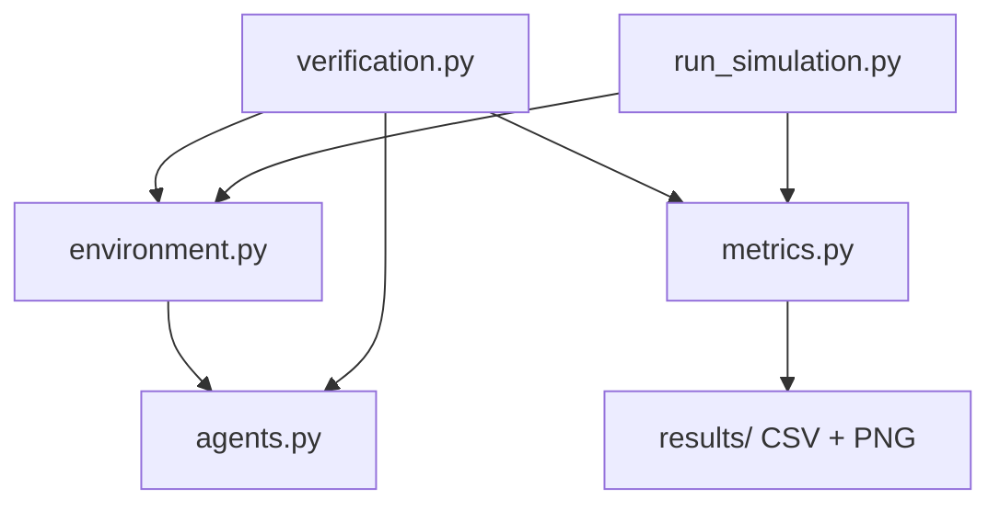
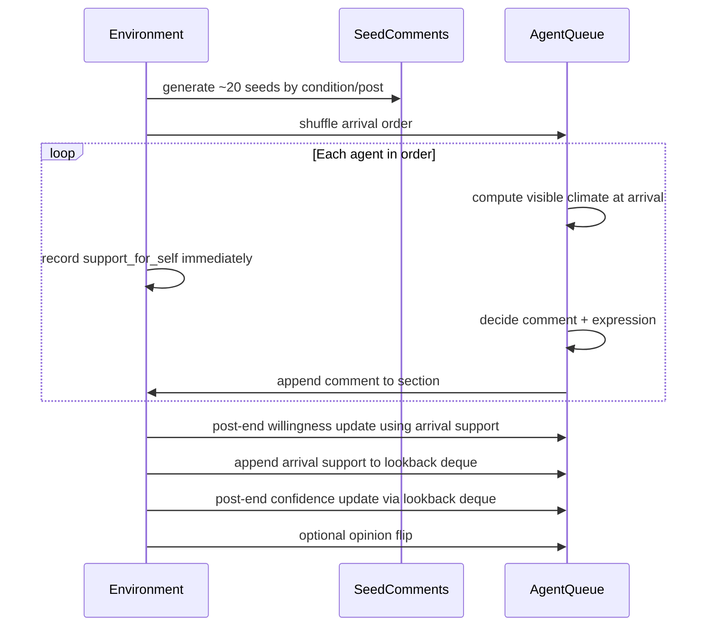

# ABM Path Dependence — Implementation Plan

> **Note:** The spec file is [`PROMPT.md`](PROMPT.md). See also the Cursor plan at `.cursor/plans/abm_implementation_plan_6fc4c890.plan.md`.

## Architecture Overview



**Core simulation loop (one post):**



---

## Critical Design: Arrival-Time `support_for_self`

Two related rules govern how agents form impressions. Both must be implemented exactly as described below.

### Rule 1 — Record at arrival, use at post-end for willingness

When an agent reaches the front of the arrival queue, the environment computes `support_for_self` from **only** the comments visible at that instant (seed comments plus any comments from agents who arrived earlier in this post). This value must be:

1. **Computed and stored immediately** in `environment.py` before the agent's comment/expression decision and before any later agent comments.
2. **Never recomputed** at post-end from the final comment-section state.
3. **Used later** (after all agents have processed) as the sole input to `apply_post_end_willingness(support_for_self)` in `agents.py`.

`environment.py` maintains a per-post dict `arrival_support: dict[int, float]` keyed by agent index. Flow per agent during arrival processing:

```
support = agent.visible_support_for_self(n_a, n_b)   # current visible counts only
arrival_support[agent.agent_id] = support            # store immediately
agent.decide_to_comment(support, rng)
agent.decide_expression(support, rng)                  # if commenting
# then update n_a / n_b if agent expressed a comment
```

Post-end willingness update (after the full queue is drained):

```
for agent in agents:
    agent.apply_post_end_willingness(arrival_support[agent.agent_id])
```

### Rule 2 — Confidence lookback uses arrival-time impressions, not post-end climate

Each agent maintains an `arrival_support_history` deque (max length 3) on the `Agent` object. After each post ends:

1. Append **that agent's arrival-time** `support_for_self` (from `arrival_support[agent.agent_id]`) to the deque.
2. Pass the deque (most-recent-first) into `apply_post_end_confidence` for recency-weighted averaging.

Agents form impressions based on what they saw when they arrived, **not** what the comment section looked like after all 200 agents had commented. The final post-level A/B ratio must never be written into the lookback deque.

```python
# After willingness update, per agent:
agent.arrival_support_history.appendleft(arrival_support[agent.agent_id])
agent.apply_post_end_confidence(list(agent.arrival_support_history), lookback_n)
```

Recency weights (3 / 2 / 1, normalized) apply to the most recent arrival-time values in the deque.

---

## Key Global Design Decisions

| Decision | Choice | Rationale |
|----------|--------|-----------|
| RNG | Single `numpy.random.Generator` passed into all constructors | Spec constraint; enables deterministic verification |
| Agent representation | Plain Python class | States mutate every post; traits set once at init |
| Control vs treatments | Control = neutral all 40 posts; Treatments 1–3 = favor-A posts 1–20, then diverge | Control is baseline without suppression phase |
| Seed comments | Exactly 20 per post; each label drawn independently (p=0.7 for favored side) | Matches "~20" and "~70%" language |
| Willingness climate signal | Each agent's own **arrival-time** `support_for_self`, stored in `arrival_support` dict | Step 4 is per-agent; must not use post-end climate |
| Confidence lookback | Per-agent `arrival_support_history` deque of arrival-time values (max 3) | Agents remember what they saw when they arrived |
| Opinion flip | `enable_opinion_flip: bool = False` on `Simulation` | Off by default; ablation toggles it |
| Results format | One CSV per condition; figures as PNG in `results/figures/` | Spec requirement |
| Dependencies | `numpy`, `pandas`, `matplotlib` | NumPy for sim; pandas for CSV; matplotlib for plots |
| No global state | Only `Simulation` holds run state | Per SKILL.md coding convention |

---

## Files to Create

| File | Responsibility |
|------|----------------|
| `requirements.txt` | Pinned dependencies |
| `.gitignore` | Ignore `results/`, `__pycache__`, etc. |
| `agents.py` | Agent traits, state, update rules; `arrival_support_history` deque |
| `environment.py` | Conditions, seeds, arrival queue; **records `arrival_support` at arrival time** |
| `metrics.py` | Outcome measures, CSV export, trajectory plots |
| `verification.py` | All 6 check categories |
| `run_simulation.py` | CLI entry point, all conditions, output |
| `SKILL.md` | Context-management reference |
| `README.md` | Setup and usage |
| `Dockerfile` | Container for `run_simulation.py` |
| `PLAN.md` | This document |

---

## Implementation Order

1. `requirements.txt`, `.gitignore`
2. `agents.py`
3. `environment.py` (arrival-time recording is the critical path)
4. `metrics.py`
5. `verification.py`
6. `run_simulation.py`
7. Smoke test: `python verification.py` then `python run_simulation.py`
8. `SKILL.md`, `README.md`, `Dockerfile`

---

## Critical Correctness Checks

1. **Arrival-time recording:** `arrival_support[agent_id]` is set before comment decisions and before `n_a`/`n_b` are updated by that agent's comment.
2. **Update ordering:** Post-end willingness/confidence updates run only after the full arrival queue is processed.
3. **Lookback source:** `arrival_support_history` contains only per-agent arrival-time values, never post-end global climate.
4. **Seeds in climate:** Seed comments count in `N_A` / `N_B` before the first agent arrives.
5. **Control isolation:** Control never receives favor-A seeds.
6. **Clipping:** All probabilities and state variables clipped to `[0, 1]`.
