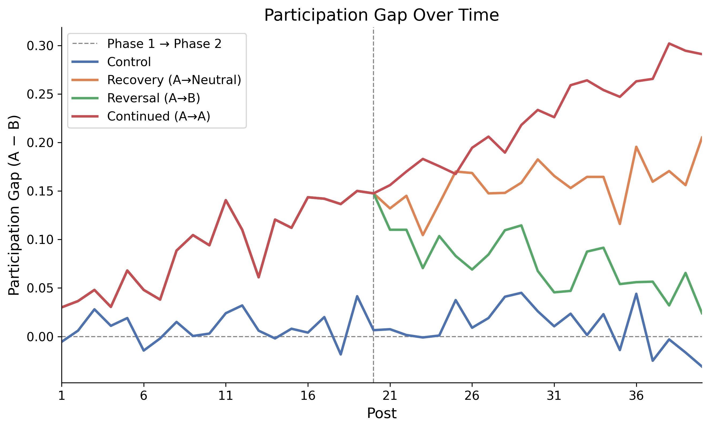
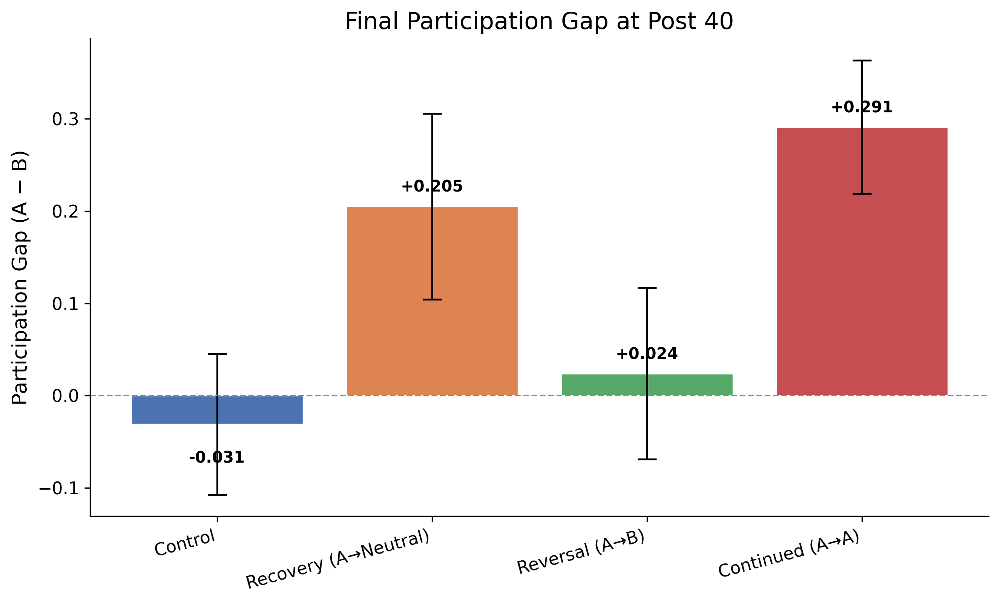
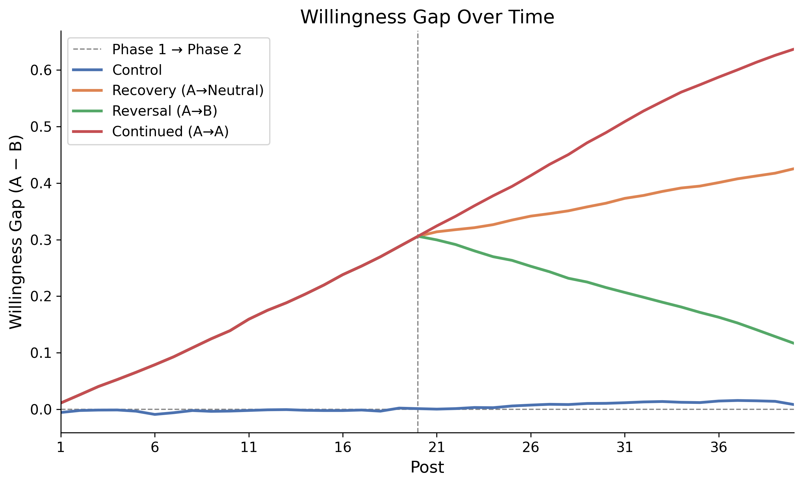
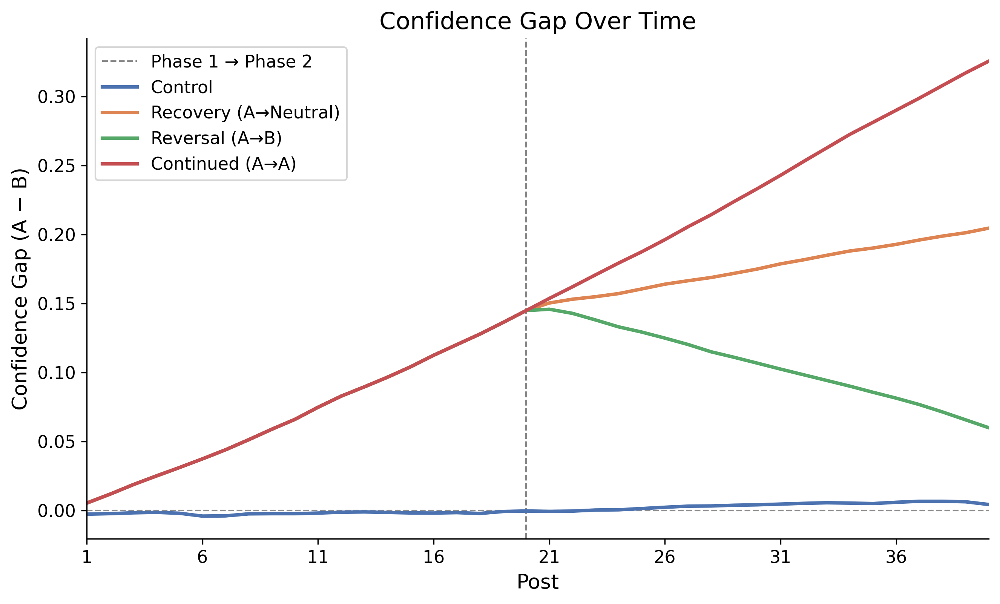
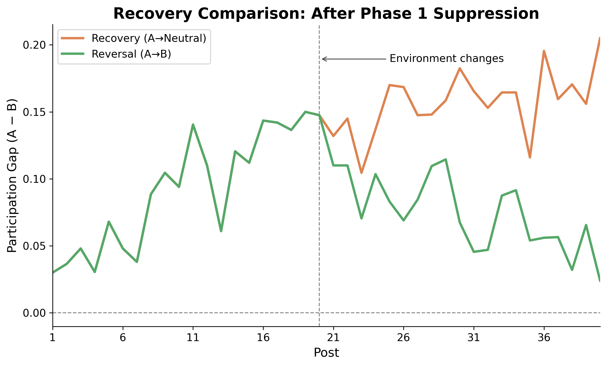
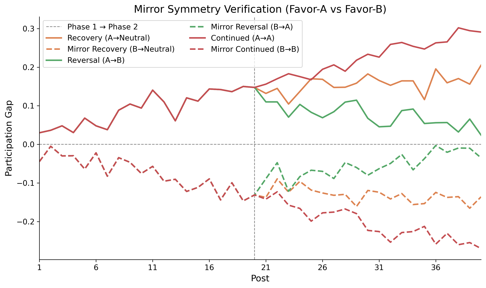

# ABM Project: Online Opinion Climates

This Python agent based model aims to examine whether early visible comment bias suppresses minority participation，and whether that suppression persists after the environment changes.

## Research Question

When a balanced population is repeatedly exposed to comment sections favoring one opinion in early visible comments, does the suppressed group's willingness to comment recover when conditions change, or does early bias create a lasting effect?

See [PROMPT.md](PROMPT.md) for the full specification.

## Setup and Usage

### Run Locally

```bash
pip install -r requirements.txt
python run_simulation.py --sensitivity --sensitivity-seeds 20
```

Requires Python 3.10+. This runs all eight conditions, aggregates results across 20 seeds, and saves figures to `results/figures/`.

Other options:

```bash
# Single seed run (faster)
python run_simulation.py --seed 42

# Generate figures only from existing results
python make_figures.py

# Run verification checks
python verification.py
```

### Run with Docker

Clone the repository :

```bash
git clone https://github.com/Kelly-Yin-99/repo.git
```bash

Navigate to the project directory:

```bash
cd repo/abm-project
```bash

Build the Docker image and run the simulation inside Docker:

```bash
docker build -t abm-simulation .
docker run --rm -v "$(pwd)/results:/app/results" abm-simulation
```

## Model Specification

### Agents

The simulation contains 200 agents with balanced private opinions (100 Opinion A, 100 Opinion B). Agents arrive in a randomly shuffled order within each post and only see comments made before them in the arrival queue. Each agent has five fixed traits sampled once at initialization from Uniform(0, 1) and four dynamic state variables that evolve across posts.

**Fixed Traits**

| Parameter | Description |
|-----------|-------------|
| `participation_tendency` | Baseline willingness to comment, independent of social environment |
| `social_sensitivity` | How strongly visible comment climate influences behavior and internal state updates |
| `conformity_tendency` | Probability of expressing the majority opinion when private opinion conflicts with visible climate |
| `update_rate` | Speed at which opinion confidence updates in response to climate signals |
| `stubbornness` | Resistance to social influence; also determines how many recent posts the agent looks back on (0 = looks back 3 posts, 1 = ignores history) |

**Dynamic State Variables**

| Variable | Initial Value | Description |
|----------|--------------|-------------|
| `private_opinion` | A or B (50/50) | The agent's underlying opinion; fixed unless confidence collapses below 0.15 (opinion flip, disabled by default) |
| `opinion_confidence` | 0.5 | How strongly the agent perceives their opinion as socially acceptable; carries across posts |
| `willingness_to_comment` | 0.5 | Current motivation to participate; updated by post-end climate signal |
| `silence_streak` | 0 | Number of consecutive posts without commenting |

### Update Rules

At each post, agents go through six steps in order.

**Step 1 — Compute visible climate (at arrival)**

Each agent observes the current comment section when they arrive. Support is calculated from seed comments plus any agent comments already made before them:

```python
support_A = N_A / (N_A + N_B)
support_for_self = support_A  # if Opinion A
support_for_self = support_B  # if Opinion B
# If no comments visible yet: support_for_self = 0.5
```

**Step 2 — Decide whether to comment**

```python
p_comment = participation_tendency * 0.4
           + willingness_to_comment * 0.4
           + social_sensitivity * (support_for_self - 0.5) * 0.2
p_comment = clip(p_comment, 0, 1)
```

**Step 3 — Decide what to express (if commenting)**

```python
if support_for_self >= 0.5:
    express private_opinion
else:
    p_conform = conformity_tendency * social_sensitivity * (1 - support_for_self)
    p_conform = clip(p_conform, 0, 1)
    if Bernoulli(p_conform):
        express majority opinion  # conforming
    else:
        express private_opinion
    silence_streak = 0
```

**Step 4 — Willingness update (post-end, uses arrival-time support)**

```python
willingness += social_sensitivity * (arrival_support - 0.5) * 0.1
willingness = clip(willingness, 0, 1)
```

**Step 5 — Confidence update (post-end, arrival-time lookback)**

```python
lookback_n = round((1 - stubbornness) * 3)
# append arrival_support to history (maxlen=3)
weighted_climate = recency_weighted_average(history, weights=[3,2,1])
confidence += update_rate * (1 - stubbornness) * (weighted_climate - 0.5) * 0.1
confidence = clip(confidence, 0, 1)
```

**Step 6 — Opinion flip (disabled by default)**

```python
if enable_opinion_flip and confidence < 0.15:
    flip private_opinion
    confidence = 0.5
```

### Experimental Conditions

| Condition | Phase 1 (posts 1–20) | Phase 2 (posts 21–40) |
|-----------|----------------------|----------------------|
| Control | Neutral | Neutral |
| Recovery (A→Neutral) | Favor-A | Neutral |
| Reversal (A→B) | Favor-A | Favor-B |
| Continued (A→A) | Favor-A | Favor-A |

Mirror (favor-B) conditions follow the same structure with A and B reversed.

### Seed Comments

Each post begins with approximately 20 seed comments generated before any agent arrives. Seed composition varies by condition:

- **Neutral**: ~50% A, ~50% B
- **Favor-A**: ~70% A, ~30% B
- **Favor-B**: ~70% B, ~30% A

### Outcome Metrics

| Metric | Definition |
|--------|------------|
| `participation_rate_A/B` | Proportion of A/B-opinion agents who commented that post |
| `participation_gap` | participation_rate_A − participation_rate_B |
| `mean_confidence_A/B` | Mean opinion_confidence across A/B agents |
| `mean_willingness_A/B` | Mean willingness_to_comment across A/B agents |
| `comment_imbalance` | abs(prop_A − prop_B) among agent-generated comments only (seeds excluded) |
| `conformity_rate` | Proportion of agent comments expressing majority opinion against private opinion |
| `silence_streak_mean/max` | Distribution of consecutive silent posts across agents |
| `cascade_probability` | Proportion of runs where comment_imbalance exceeds 0.3 |


## Results

All figures are generated from 20-seed sensitivity runs. Reported values are means ± standard deviations across seeds. The figures below were generated by `make_figures.py`, which I added manually because the AI-generated implementation did not produce the figures I wanted. The original code had `plot_trajectories()` calls inside `run_simulation.py`, which mixed figure generation with simulation logic. I also removed those calls from `run_simulation.py` and wrote `make_figures.py` as a standalone script instead, so figures can be regenerated from existing results without re-running the full simulation. Legend labels and layout were manually adjusted in `make_figures.py`. The original `plot_trajectories()` function in `metrics.py` was left in place but is no longer called.


### Main Finding: Early Visibility Bias Produces Path-Dependent Suppression



All three treatment conditions share identical Phase 1 (posts 1–20, favor-A seeds), during which the participation gap widens from near zero to approximately 0.15. The control condition remains near zero throughout all 40 posts, confirming that divergence is caused by seed bias rather than random drift.

After the environment changes at post 21:

- **Recovery (A→Neutral)**: Gap persists and continues rising, reaching 0.205 ± 0.098 at post 40. Removing bias is not sufficient for recovery.
- **Reversal (A→B)**: Gap trends back toward zero, reaching 0.024 ± 0.090 at post 40. Recovery requires active counter-pressure.
- **Continued (A→A)**: Gap deepens to 0.291 ± 0.071 at post 40.




### Two Pathways of Suppression





The model contains two independent suppression pathways. Willingness responds quickly to each post's climate signal. Confidence updates more slowly through the lookback mechanism, reflecting accumulated impressions from up to three recent posts. Both gaps grow during Phase 1 and diverge after post 21. The confidence gap for Recovery continues growing even after the environment becomes neutral, while Reversal shows a clean decline. These suggest that agents' internal sense of social acceptability is harder to reverse than their moment-to-moment motivation to comment.


### Recovery Requires Active Counter-Pressure



After identical Phase 1 suppression, the Recovery condition (neutral Phase 2) does not stabilize the gap and it continues to rise instead. Only the Reversal condition (favor-B Phase 2) drives the gap back toward zero. This suggests that agents whose confidence has been eroded do not spontaneously recover when pressure is removed. They require an actively supportive environment.


### Symmetry Verification



Mirror conditions (favor-B Phase 1) produce approximately opposite-sign participation gaps. The sum of original and mirror gaps at post 40 ranges from −0.011 to +0.069, confirming the model does not structurally favor Opinion A over Opinion B.


### Control Condition Diagnostic

A secondary analysis found that the willingness state variable showed small divergence in the control condition even under neutral seeds (approximately ±0.005–0.008 from 0.5 by post 40). This was traced to a self-reinforcing carryover mechanism:

1. Even with neutral seeds, arrival-order randomness creates slightly asymmetric `support_for_self` values within each post.
2. Post-end updates  push A and B agents in opposite directions when one group encounters a slightly more favorable climate.
3. Small per-post updates accumulate over 40 posts, producing visible trends in state variable plots.
4. Crucially, this drift does not translate into meaningful participation imbalance. The `p_comment` formula weights `participation_tendency` at 0.4, which acts as a stabilizing anchor. The control participation gap at post 40 is −0.031 ± 0.074 across 20 seeds with no consistent directional drift.


## Reflection

Before any code was written, two issues were identified and corrected at the plan stage: the post-end willingness update needed to use each agent's arrival-time `support_for_self` rather than the final post climate, and the confidence lookback deque needed to store arrival-time impressions rather than post-level aggregate statistics. 

During implementation, code was reviewed file by file. The exact formulas for `decide_to_comment()`, `decide_expression()`, and seed comment initialization were inspected directly against the specification. The formal verification suite (`python verification.py`) ran six checks: deterministic seed reproduction, population invariants after every post, balanced initialization, edge cases under extreme parameter values, ablation checks confirming each mechanism weakens effects when disabled, and a 20-seed sensitivity check.

Several issues were caught through diagnostic investigation. First, agents were hitting absorbing boundaries (willingness or confidence reaching 0 or 1) within three posts; diagnosed via per-agent print statements and fixed by adding a global 0.1 dampening factor. Second, a condition-specific stabilization rule applied only to the control condition was identified as scientifically invalid and reverted — all conditions must use identical update rules. Third, apparent drift in control willingness plots was investigated and confirmed not to affect participation behavior, with the control participation gap remaining within ±0.031 across 20 seeds.

The three treatment conditions produce separated trajectories that are consistent across 20 seeds, pass all verification checks, and replicate symmetrically under favor-B conditions. This gives me confidence in the directional pattern. However, the dampening factor was calibrated by inspection rather than systematic search. It would be better to implement sensitivity analysis over this parameters Moreover, the model isolates a single mechanism under highly simplified assumptions without natural language, direct replies, platform ranking effects, etc. Whether the same pattern holds under realistic conditions remains an open question that this model cannot answer.

## Output Structure

```
results/
├── control_neutral_all40/post_metrics.csv
├── treatment1_recovery_to_neutral/post_metrics.csv
├── treatment2_reversal_A_to_B/post_metrics.csv
├── treatment3_continued_A_to_A/post_metrics.csv
├── mirror_control_neutral_all40/post_metrics.csv
├── mirror_treatment1_recovery_to_neutral/post_metrics.csv
├── mirror_treatment2_reversal_B_to_A/post_metrics.csv
├── mirror_treatment3_continued_B_to_B/post_metrics.csv
├── sensitivity_summary.csv              
└── figures/
    ├── fig1_participation_gap.png
    ├── fig2_willingness_gap.png
    ├── fig3_confidence_gap.png
    ├── fig4_final_participation_gap.png
    ├── fig5_recovery_comparison.png
    ├──fig6_mirror_symmetry.png
    └── Old_figures/
```

## Project Structure

| File | Purpose |
|------|---------|
| `agents.py` | Agent traits, state, update rules |
| `environment.py` | Simulation loop, seeds, arrival queue |
| `metrics.py` | Outcome measures and CSV export |
| `verification.py` | Verification and ablation checks |
| `run_simulation.py` | Run conditions and calls `generate_all_figures()` |
| `make_figures.py` |  figure generation (`generate_all_figures`) |
| `SKILL.md` | Cursor context reference |
| `PLAN.md` | Implementation plan |
| `PROMPT.md` | Full project specification |


